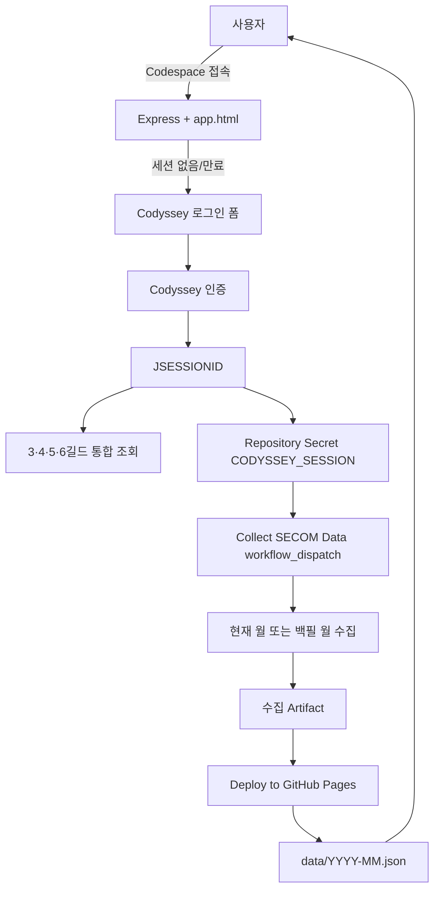

# 🎯 Codyssey Jail Tracker

Codyssey의 **3·4·5·6길드** 멤버 SECOM 출입/학습 기록을 하나로 합쳐 보여주는 대시보드입니다.

- **GitHub Pages:** https://giyeop-cody.github.io/codyssey_Jail_Tracker/
- **Codespaces:** [Open in GitHub Codespaces](https://github.com/codespaces/new/giyeop-cody/codyssey_Jail_Tracker?devcontainer_path=.devcontainer%2Fdevcontainer.json)
- **기본 조회 월:** 접속 시점의 KST 현재 연·월
- **공개 월별 기록:** `data/YYYY-MM.json` 형식으로 보관

---

## 목차

1. [주요 기능](#주요-기능)
2. [집계 기준](#집계-기준)
3. [전체 동작 구조](#전체-동작-구조)
4. [최초 GitHub 설정](#최초-github-설정)
5. [사용 방법](#사용-방법)
6. [과거 월 조회와 백필](#과거-월-조회와-백필)
7. [GitHub Actions](#github-actions)
8. [환경변수](#환경변수)
9. [API](#api)
10. [프로젝트 구조](#프로젝트-구조)
11. [개발 및 테스트](#개발-및-테스트)
12. [문제 해결](#문제-해결)
13. [보안 및 비용](#보안-및-비용)

---

## 주요 기능

### 대시보드

- 3·4·5·6길드 멤버를 하나의 통합 랭킹으로 표시
- 월간 인정 학습시간, 출석일, 일평균 시간 제공
- 월 기록이 없는 멤버도 랭킹 하단에 `0h`로 표시
- 날짜별 출입 인원 및 학습시간 캘린더
- 시간대·요일·주차별 통계 차트
- 현재 출입 중인 멤버 표시
- 멤버별 일일 출입 세션 상세 조회

### 연·월 조회

- Codespace와 GitHub Pages 모두 연도·월 변경 가능
- 첫 화면은 항상 현재 KST 연·월
- 연·월 입력 후 `불러오기` 또는 달력의 `‹`, `›` 버튼으로 이동
- Pages는 저장된 `data/YYYY-MM.json`을 조회
- 없는 월은 오류 대신 “해당 월 기록이 없습니다” 안내

### 세션 자동화

- 세션 없음/만료 시 Codespace에서 로그인 폼 표시
- 로그인 성공 시 새 `JSESSIONID` 확보
- `CODYSSEY_SESSION` Repository Actions Secret 자동 생성/갱신
- Secret 저장 직후 `Collect SECOM Data` workflow 자동 실행
- 수집 성공 후 GitHub Pages 자동 배포
- Secret 저장과 workflow 실행이 부분 실패하면 실제 GitHub API 오류 표시

---

## 집계 기준

### 조회 대상

서버에서 조회 대상을 다음 값으로 고정합니다.

```js
[3, 4, 5, 6]
```

프런트엔드 또는 외부 요청에서 `guildIds`, `allGuilds`를 전달해도 무시합니다. 길드 번호 입력 UI도 제공하지 않습니다.

### 중복 멤버

중복 여부는 이름이 아니라 Codyssey 내부 고유값인 **`mbrId`**로 판단합니다.

- 같은 `mbrId`가 여러 길드 응답에 있으면 한 명으로 병합
- 병합된 멤버의 `guildNames`에 길드명만 추가
- 이름이 같아도 `mbrId`가 다르면 서로 다른 사람으로 유지
- 공개 Pages에서는 병합 완료 후 `mbrId`를 제거하고 해시된 `_publicId`로 교체

### 전체 멤버와 활동 멤버

- **전체 멤버:** 네 길드 응답을 `mbrId` 기준으로 중복 제거한 전체 인원
- **활동 멤버:** 선택한 월의 SECOM 인정시간이 1초 이상인 인원
- **0시간 멤버:** 해당 월 기록은 없지만 전체 랭킹에는 포함되는 인원
- **현재 출입 중:** 오늘 입실 후 퇴실 기록이 없는 세션을 가진 인원

활동 멤버와 현재 출입 중 인원은 서로 다른 지표입니다.

---

## 전체 동작 구조



### Codespace 라이브 모드

- Express 백엔드가 Codyssey API에 직접 요청
- 연·월 변경 시 즉시 다시 집계
- 세션 만료를 감지하면 새로고침 반복 없이 로그인 폼으로 전환
- 로그인 후 Secret 저장 및 Action 실행 결과를 상단 배지로 표시

### GitHub Pages 공개 모드

- 백엔드가 없는 읽기 전용 정적 모드
- 민감정보 제거가 끝난 월별 JSON만 사용
- 기존 Pages 월별 파일과 새 수집 파일을 병합하여 과거 월 유지
- 세션이 없어 데이터가 없으면 Codespace 실행 버튼 표시

---

## 최초 GitHub 설정

### 1. Fine-grained PAT 발급

GitHub 개인 설정에서 다음 경로로 이동합니다.

```text
Settings
→ Developer settings
→ Personal access tokens
→ Fine-grained tokens
→ Generate new token
```

권장 설정:

| 항목 | 값 |
|---|---|
| Repository access | Only select repositories |
| Repository | `giyeop-cody/codyssey_Jail_Tracker` |
| Secrets | Read and write |
| Actions | Read and write |
| Metadata | Read-only |

- `Secrets` 권한: `CODYSSEY_SESSION` 생성/갱신
- `Actions` 권한: `Collect SECOM Data` workflow 실행
- Classic PAT를 사용하면 `repo` 스코프 필요

### 2. Codespaces Secret 등록

저장소에서 다음 경로로 이동합니다.

```text
Settings
→ Secrets and variables
→ Codespaces
→ New repository secret
```

| 항목 | 값 |
|---|---|
| Name | `GH_PAT_SYNC` |
| Secret | 위에서 만든 PAT |

> Secret 이름은 `GITHUB_`로 시작할 수 없으므로 `GH_PAT_SYNC`를 사용합니다.

`GITHUB_REPOSITORY`는 Codespaces가 `owner/repo` 형식으로 자동 제공합니다.

### 3. Codespace 재시작

Secret을 새로 등록하거나 변경했다면 실행 중인 Codespace에 즉시 반영되지 않습니다.

1. https://github.com/codespaces 접속
2. 해당 Codespace를 **Stop**
3. 다시 **Start**
4. 필요하면 `Codespaces: Rebuild Container` 실행

### 4. 최초 로그인

1. Codespace 포트 3000의 `/app.html` 접속
2. Codyssey 계정으로 로그인
3. 상단의 `수집 요청 완료` 확인
4. Repository **Settings → Secrets and variables → Actions**에서 `CODYSSEY_SESSION` 확인
5. Actions에서 `Collect SECOM Data` 실행 확인

`CODYSSEY_SESSION`은 직접 입력하지 않습니다. Codespace 로그인 서버가 자동으로 관리합니다.

---

## 사용 방법

### GitHub Pages

1. https://giyeop-cody.github.io/codyssey_Jail_Tracker/ 접속
2. 기본 현재 연·월 데이터 확인
3. 상단 연도·월 변경 후 `불러오기`
4. 또는 캘린더의 `‹`, `오늘`, `›` 버튼 사용

Pages는 공개 저장된 월만 조회할 수 있습니다.

### Codespace

기존 Codespace를 최신화하려면:

```bash
cd /workspaces/codyssey_Jail_Tracker
git pull origin main

cd dashboard
npm ci
npm test

pkill -f 'node server.js' || true
npm start
```

접속 주소:

```text
https://<codespace-name>-3000.app.github.dev/app.html
```

### 로컬 실행

```bash
cd dashboard
npm install
npm start
```

브라우저:

```text
http://localhost:3000/app.html
```

로컬 로그인 후 GitHub Secret 자동 동기화까지 사용할 경우:

```bash
export GITHUB_TOKEN=github_pat_xxxxxxxxxxxx
export GITHUB_REPOSITORY=giyeop-cody/codyssey_Jail_Tracker
npm start
```

Codespaces에서는 `GITHUB_TOKEN` 대신 `GH_PAT_SYNC`만 사용합니다. 권한이 불명확한 기본 Codespaces 토큰으로 자동 대체하지 않습니다.

---

## 과거 월 조회와 백필

### 현재 공개 월

월별 공개 데이터는 다음 구조로 배포됩니다.

```text
data/index.json
data/2026-04.json
data/2026-05.json
data/2026-06.json
data/2026-07.json
```

`data/index.json`은 조회 가능한 월과 최신 월 메타데이터를 제공합니다.

### 과거 데이터 추가

GitHub에서:

```text
Actions
→ Collect SECOM Data
→ Run workflow
```

`backfill_from`에 시작월을 입력합니다.

```text
2026-04
```

그러면 시작월부터 현재 월까지 수집합니다. 한 번에 최대 24개월까지 허용합니다.

- 예약 실행: 현재 월만 갱신
- 로그인 직후 자동 실행: 현재 월만 갱신
- 수동 백필: 입력한 시작월부터 현재 월까지 수집

과거 월을 매번 재수집하지 않으므로 Actions 실행시간과 Codyssey API 요청량을 줄입니다.

---

## GitHub Actions

### Collect SECOM Data

파일: `.github/workflows/collect.yml`

트리거:

- 30분 예약 실행
- Codespace 로그인 직후 API dispatch
- Actions 화면 수동 실행
- 수동 실행 시 `backfill_from` 입력 지원

처리:

1. `CODYSSEY_SESSION` 확인
2. Express 서버 실행
3. 고정 길드 3·4·5·6 조회
4. `mbrId` 기준 멤버 병합
5. 월별 SECOM 집계
6. `artifacts/months/YYYY-MM.json` 생성
7. `secom-data-<run_id>` Artifact 업로드

### Deploy to GitHub Pages

파일: `.github/workflows/pages.yml`

트리거:

- Collect workflow 성공
- 대시보드/스크립트 변경 push
- 수동 실행

처리:

1. 수집 Artifact 다운로드 또는 현재 월 직접 수집
2. 기존 공개 월별 기록 복원
3. 민감 필드 제거
4. 새 월별 데이터 병합
5. `data/index.json`, `data/YYYY-MM.json` 생성
6. GitHub Pages 배포

### Artifact 보관

- 수집 Artifact: 7일
- Pages Artifact: GitHub Pages 기본 보관정책
- 장기 공개 기록: Pages의 월별 JSON으로 유지

---

## 환경변수

| 변수 | 사용 위치 | 필수 여부 | 설명 |
|---|---|---:|---|
| `PORT` | 서버 | 선택 | 기본 `3000` |
| `CODYSSEY_SESSION` | Actions/서버 | Actions 필수 | Codyssey `JSESSIONID` |
| `CODYSSEY_ID` | 서버 | 선택 | 환경변수 자동 로그인 ID |
| `CODYSSEY_PW` | 서버 | 선택 | 환경변수 자동 로그인 비밀번호 |
| `GH_PAT_SYNC` | Codespaces | Secret 동기화 시 필수 | Repository Secrets/Actions 쓰기 PAT |
| `GITHUB_TOKEN` | 로컬 | 선택 | 로컬 Secret 동기화용 PAT |
| `GITHUB_REPOSITORY` | Codespaces/로컬 | 동기화 시 필수 | `owner/repo` |
| `SECOM_COOKIE_FILE` | 서버 | 선택 | 세션 파일 경로 변경 |
| `TZ` | Actions | 선택 | `Asia/Seoul` 사용 |

Secret 값 자체를 로그나 화면에 출력하지 마세요.

---

## API

| Method | Endpoint | 설명 |
|---|---|---|
| `GET` | `/api/session` | 로그인 및 GitHub 동기화 상태 |
| `POST` | `/api/login` | Codyssey 로그인, Secret 저장, workflow 실행 |
| `POST` | `/api/logout` | 메모리/디스크 세션 제거 |
| `POST` | `/api/sync-github` | 현재 세션 재동기화 및 수집 재실행 |
| `GET` | `/api/session/debug` | 쿠키 이름 등 값 없는 진단정보 |
| `POST` | `/api/aggregate` | 고정 네 길드 통합 월별 집계 |
| `GET` | `/api/guilds` | 진단용 길드 목록 조회 |
| `GET` | `/api/guild/:guildId` | 진단용 단일 길드 조회 |
| `GET` | `/api/secom/:mbrId` | 진단용 단일 멤버 SECOM 조회 |

`POST /api/aggregate` 예시:

```json
{
  "year": 2026,
  "month": 7,
  "seasonId": 5,
  "weekNo": 9
}
```

`guildIds`나 `allGuilds`를 전달해도 조회 범위는 변경되지 않습니다.

---

## 프로젝트 구조

```text
├── .devcontainer/
│   └── devcontainer.json
├── .github/workflows/
│   ├── collect.yml                 # 월별 데이터 수집
│   └── pages.yml                   # 월별 기록 병합 및 Pages 배포
├── dashboard/
│   ├── lib/
│   │   ├── github-sync.js          # Secret 암호화/업로드/workflow dispatch
│   │   └── tracked-guilds.js       # 고정 길드 및 mbrId 병합
│   ├── public/
│   │   ├── app.html                # 대시보드 마크업
│   │   ├── app.css                 # 대시보드 스타일
│   │   ├── app.js                  # 라이브/공개 모드 UI 로직
│   │   └── index.html              # 로컬 소개 페이지
│   ├── scripts/
│   │   ├── build-public-history.js # 기존 월 복원 + 신규 월 병합
│   │   └── sanitize-for-public.js  # 공개 데이터 민감정보 제거
│   ├── test/                        # Node 내장 테스트
│   ├── package.json
│   └── server.js                    # Express/Auth/API/Aggregate 조립
├── collect_all.js
├── collect_guild_members.js
├── collect_secom.js
└── README.md
```

### 리팩터링 원칙

- `server.js`: HTTP 라우팅, 세션, Codyssey API 집계 조립
- `lib/github-sync.js`: GitHub 인증/Secret/workflow 책임 분리
- `lib/tracked-guilds.js`: 고정 길드와 멤버 병합 책임 분리
- `app.html`, `app.css`, `app.js`: 마크업·스타일·동작 분리
- `scripts`: CI/Pages 빌드 전용 로직 분리
- 외부 동작은 테스트 가능한 순수 함수 또는 주입 가능한 서비스로 유지

---

## 개발 및 테스트

```bash
cd dashboard
npm ci
npm test
```

테스트 범위:

- 고정 길드 3·4·5·6
- 길드 번호 UI 미노출
- `mbrId` 중복 병합과 동명이인 분리
- 0시간 멤버 랭킹 포함
- 세션 만료 시 로그인 화면 전환
- Secret 저장 후 workflow dispatch
- GitHub API 오류 전달
- 공개 데이터 민감정보 제거
- 월별 기록 사이트 빌드
- 현재 연·월 기본값 및 과거 월 조회

문법 확인:

```bash
node --check server.js
node --check lib/github-sync.js
node --check public/app.js
node --check scripts/build-public-history.js
```

---

## 문제 해결

| 증상 | 원인 | 해결 |
|---|---|---|
| 로그인 폼 대신 세션 만료 반복 | 이전 서버/만료 쿠키 | 최신 코드 pull 후 서버 재시작 |
| `GH_PAT_SYNC=missing` | Codespaces Secret 미주입 | Codespace Stop/Start 또는 Rebuild |
| Secret 저장 403 | PAT `Secrets` 권한 부족 | Secrets `Read and write` |
| Action 실행 403 | PAT `Actions` 권한 부족/이전 토큰 | Actions `Read and write`, Secret 갱신, Codespace 재시작 |
| Secret은 갱신됐지만 Action 없음 | workflow dispatch 실패 | 상단 재시도 또는 다음 30분 예약 실행 대기 |
| 과거 월 없음 | 월별 공개 데이터 미수집 | `backfill_from`으로 수동 백필 |
| Pages에 길드 번호 표시 | 오래된 Pages 배포/캐시 | 최신 Pages Action 확인 후 강력 새로고침 |
| Codespace가 이전 UI 표시 | 이전 checkout/Node 프로세스 | `git pull`, `pkill`, `npm start` |

진단 명령:

```bash
if [ -n "${GH_PAT_SYNC:-}" ]; then echo "GH_PAT_SYNC=set"; else echo "GH_PAT_SYNC=missing"; fi
echo "$GITHUB_REPOSITORY"
git rev-parse --short HEAD
curl -s http://localhost:3000/api/session | python -m json.tool
```

---

## 보안 및 비용

### 보안

- Codyssey 아이디/비밀번호는 Codespace/로컬 서버에서 Codyssey 인증 서버로만 전달
- GitHub에는 비밀번호가 아닌 `JSESSIONID`만 Actions Secret으로 저장
- Secret 업로드 전 libsodium sealed box로 암호화
- Pages 공개 데이터에서 다음 필드 제거:
  - 이메일
  - 내부 `mbrId`
  - 길드 ID
  - 로그인 사용자
  - GitHub 동기화 내부 상태
- `.session-cookies.json`은 `.gitignore` 대상
- PAT는 코드, 커밋, 채팅, 터미널 출력에 남기지 않음

### 비용

- 저장소가 Public이고 표준 `ubuntu-latest`를 사용하므로 Actions 실행시간은 무료
- 30분 수집은 현재 월만 처리
- 과거 월은 필요할 때만 수동 백필
- Codespace는 로그인/세션 갱신 후 Stop 권장
- 사용하지 않는 Codespace는 Delete하여 Storage 사용 방지

---

## 라이선스

현재 `dashboard/package.json` 기준 ISC 라이선스입니다.
