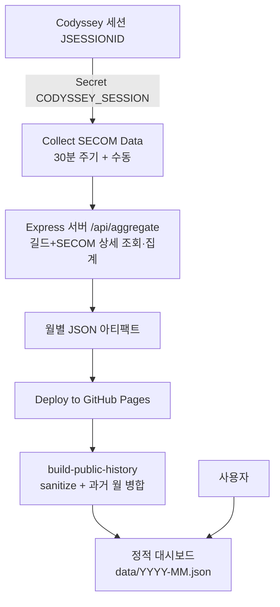

# 🎯 Codyssey Jail Tracker

Codyssey **3·4·5·6길드** 멤버의 SECOM 출입/학습 기록을 하나로 합쳐 보여주는 월간 대시보드입니다.

- **공개 데모 (GitHub Pages):** https://giyeop-cody.github.io/codyssey_Jail_Tracker/
- 수집은 GitHub Actions가 30분 주기로 수행하고, 결과는 민감정보를 제거한 뒤 정적 페이지로 공개됩니다.

---

## 목차

1. [목표](#목표)
2. [기획](#기획)
3. [구현](#구현)
4. [사용법](#사용법)
5. [Fork해서 사용하는 방법](#fork해서-사용하는-방법)
6. [개발 및 테스트](#개발-및-테스트)
7. [문제 해결](#문제-해결)

---

## 목표

- 네 길드(3·4·5·6)의 멤버별 **월간 인정 학습시간, 출석일, 일평균**을 한 화면에서 비교한다.
- 날짜별 출입 인원·시간 캘린더, 시간대/요일/주차 통계, **현재 입실 중** 목록을 제공한다.
- 월이 지나도 기록이 남도록 **월별 공개 스냅샷(`data/YYYY-MM.json`)** 을 쌓는다.
- Codyssey 서버 부하를 줄이면서(읽기 전용·캐시·제한 동시성) 안정적으로 수집한다.

## 기획

### 대상과 병합 규칙

- 조회 길드는 서버에서 **`[3, 4, 5, 6]`으로 고정**. 프런트엔드/외부 요청에서 다른 길드를 지정해도 무시한다.
- 같은 사람이 여러 길드에 있으면 **`mbrId` 기준으로 한 명으로 병합**(이름이 아님). 이름이 같아도 `mbrId`가 다르면 다른 사람으로 유지한다.
- **전체 멤버:** 병합 후 전체 인원 / **활동 멤버:** 해당 월 인정시간 1초 이상 / 기록 없는 멤버도 랭킹에 `0h`로 포함한다.

### 갱신 주기 설계

- 입퇴실 기록은 빠르게 바뀌므로 **30분 주기 수집**(GitHub Actions cron).
- 로스터(멤버 mbrId·이름·레벨·프로필 매핑)는 준정적 데이터라 **8시간 신선하면 길드 API 생략**(하루 3~4회 갱신 수준). 만료 시에만 길드 API 재조회, 실패 시 오래된 캐시로 폴 백한다.
- GitHub 스케줄러가 30분 간격을 지키지 못하는 경우가 있어(실측 평균 배달 82~110분) **30분 슬롯당 4개의 크론 스트림**으로 발화 기회를 넓혔다.

### 자정/월 경계 롤오버

- 밤샘 학습자는 퇴실 전까지 전날 레코드에 남는다. 입실 판정은 **오늘 + 어제** 이틀 창으로 열린 세션을 본다.
- 매월 1일에는 열린 세션이 전월 상세에만 있을 수 있어, 현재 월 집계 시 **전월 상세를 추가 조회해** 전월 말일 열린 세션을 입실 목록에 병합한다.

### 공개 정책

- Pages에는 대시보드 표시에 필요한 필드만 남긴다. `email`은 어디에도 쓰이지 않아 수집 캐시·공개 JSON 모두에서 제외한다.
- 공개 JSON에서는 `mbrId` 대신 해시된 `_publicId`를 사용한다(`scripts/sanitize-for-public.js`).

## 구현

### 동작 구조



- **Collect SECOM Data**(`.github/workflows/collect.yml`): 30분×4 스트림 + 수동(`backfill_from`). 서버를 띄워 `/api/aggregate`를 호출하고 검증 후 아티팩트로 올린다. 로스터는 `actions/cache`(`secom-roster-v2-` 키)로 유지한다.
- **Deploy to GitHub Pages**(`.github/workflows/pages.yml`): 수집 성공을 트리거로, 수집 아티팩트 + 기존 Pages 월별 데이터를 병합해 `_site`를 만들고 `actions/deploy-pages`로 배포한다. UI 변경 push 시에는 즉시 1회 수집해 배포한다.
- **Codespace 라이브 모드**(`dashboard/server.js`): `/app`에서 세션 로그인 → 실시간 집계. 로그인 성공 시 새 `JSESSIONID`를 `CODYSSEY_SESSION` Secret에 자동 저장하고 수집 workflow를 즉시 실행한다.

### 디렉터리

```
├── .devcontainer/devcontainer.json   # Codespace: 포트 3000 + GH_PAT_SYNC 선언
├── .github/workflows/
│   ├── collect.yml                   # 30분 수집 → 아티팩트 (Secret: CODYSSEY_SESSION)
│   └── pages.yml                     # 아티팩트 병합 → deploy-pages
├── collect_all.js                    # 로컬 수집/백필 CLI
└── dashboard/
    ├── server.js                     # Express: 세션/로그인/집계 API
    ├── lib/
    │   ├── tracked-guilds.js         # 고정 길드 목록 + mbrId 병합
    │   ├── open-session.js           # 열린 세션/자정·월 경계 판정
    │   ├── roster-cache.js           # 로스터 캐시 직렬화/신선도 (email 제외)
    │   └── github-sync.js            # JSESSIONID → Secret 동기화
    ├── public/                       # 대시보드 UI (app.html + 정적 자원)
    ├── scripts/
    │   ├── sanitize-for-public.js    # 공개 JSON에서 email/mbrId 제거
    │   └── build-public-history.js   # 월별 병합 + _site 생성
    └── test/                         # node --test (37건)
```

### 사용하는 외부 API (읽기 전용)

- 길드 정보/멤버: 길드 3·4·5·6 상세
- SECOM 상세: `/rest/secom/detail?mbrId=...&year=...&month=...`
- 자체 서버 API: `/api/session`, `/api/login`, `/api/aggregate` 등은 Express 라우팅(아래 사용법 참고)

## 사용법

### 공개 대시보드 (Pages)

- 접속하면 KST 기준 현재 월을 표시. 달력의 `‹` `›` 또는 연·월 입력으로 이동한다.
- 저장된 월이 없으면 오류 대신 "해당 월 기록이 없습니다" 안내가 나온다.
- 월별 정적 파일: `.../data/YYYY-MM.json` (민감정보 제거본).

### Codespace 라이브 대시보드

1. 저장소에서 **Code → Codespaces → Create codespace on main**
2. 포트 3000에서 `/app.html` 접속 → Codyssey 로그인
3. 로그인 성공 시: 대시보드 갱신 + `CODYSSEY_SESSION` Secret 갱신 + 수집 workflow 자동 실행

### 수동 수집 (백필)

- **Actions → Collect SECOM Data → Run workflow** → `backfill_from`에 `YYYY-MM` 입력(최대 24개월) 또는 비우면 현재 월만.

### 로컬 실행

```bash
cd dashboard
npm ci
CODYSSEY_SESSION=<JSESSIONID> npm start   # http://localhost:3000/app.html
node ../collect_all.js --start 1 --end 10 --year 2026 --month 7   # 일 단위 CLI 수집
```

## Fork해서 사용하는 방법

원본의 Secret, Actions 이력, Codespace, Pages 데이터는 Fork에 복사되지 않습니다. 아래를 **Fork한 본인 저장소에서** 설정하세요.

### 1. Fork + Actions 활성화

1. 원본 저장소에서 **Fork** (이름은 `codyssey_Jail_Tracker` 권장)
2. Fork 저장소 **Actions 탭 → "I understand my workflows..."** 클릭
3. 확인할 workflow: `Collect SECOM Data`, `Deploy to GitHub Pages`

### 2. Pages 소스 지정

```
Settings → Pages → Build and deployment → Source: GitHub Actions
```

배포 후 주소: `https://<내-GitHub-ID>.github.io/<Fork-저장소명>/`

### 3. Secret 등록: `CODYSSEY_SESSION`

Codyssey `JSESSIONID` 값을 저장합니다.

```
Settings → Secrets and variables → Actions → New repository secret
  Name:  CODYSSEY_SESSION
  Value: <브라우저에서 복사한 JSESSIONID 값>
```

JSESSIONID 캡처 방법:

1. `https://usr.codyssey.kr` 로그인
2. 개발자 도구(F12) → **Application → Cookies → https://usr.codyssey.kr**
3. `JSESSIONID` 행의 **Value** 복사

> 세션은 Codyssey 쪽에서 만료되면 죽습니다. 수집이 `CODYSSEY_SESSION이 없거나 만료되었습니다`로 실패하면 새 값으로 갱신하세요.

> **(선택) 공유 로스터 허브 연동**: `codyssey_roster_hub`(비공개)를 쓰는 환경이면 Secret `HUB_PAT`(허브 Contents:Read PAT)를 등록하세요. 허브 로스터가 신선하면 길드 API를 생략합니다. 미등록이면 기존 캐시/API 경로로 돌아갑니다. 대시보드 로그인으로 허브 레포의 `CODYSSEY_SESSION`까지 자동 갱신하려면 `GH_PAT_SYNC` PAT에 허브 권한(Secrets/Actions RW)을 주고 Codespace 비밀 `GH_SYNC_EXTRA_REPOS=<owner>/codyssey_roster_hub`를 추가하세요.


### 4. 최초 실행

**Actions → Collect SECOM Data → Run workflow** → 성공하면 이어서 **Deploy to GitHub Pages**가 자동 실행됩니다. Pages 주소에 접속해 대시보드를 확인합니다.

### (선택) Codespace 자동 세션 동기화

로그인 때마다 Secret을 자동 갱신하려면:

1. Fine-grained PAT 발급: **Settings → Developer settings → Personal access tokens → Fine-grained tokens**
   - Repository access: 내 Fork 저장소만
   - 권한: **Secrets: Read and write**, **Actions: Read and write**
2. Fork 저장소 **Settings → Secrets and variables → Codespaces → New repository secret**에 이름 `GH_PAT_SYNC`로 저장
3. Codespace 생성(또는 이미 있다면 Stop → Start/Rebuild 후 Secret 반영)

이 PAT는 Codyssey 비밀번호를 저장하는 토큰이 아니라, 서버가 잡은 `JSESSIONID`를 Repository Secret에 옮기고 수집 workflow를 실행하는 데만 씁니다.

### Fork에서 동작하지 않는 것

- 원본 저장소의 과거 월별 `data/*.json` — 첫 배포부터 새로 쌓입니다 (백필로 채울 수 있음)
- 원본의 Secret/캐시/워크플로 이력

### 주의사항

- Codyssey 비공개 API를 재사용합니다. **약관/운영정책을 확인**하고 본인 계정 세션 범위에서만 사용하세요.
- 데이터에 **실명**이 포함됩니다. 공개 Pages는 sanitize를 거치지만, 저장소 공개 범위는 신중히 결정하세요.
- GitHub의 스케줄 실행은 지연될 수 있습니다(이는 플랫폼 특성이며, 4중 크론으로 완화 중).

## 개발 및 테스트

```bash
cd dashboard
npm ci
npm run check   # 전체 JS 문법 검사
npm test        # node --test (37건: 집계/롤오버/캐시/공개 변환/워크플로 배선)
```

- `npm run check`로 `server.js`, `lib/*`, `public/app.js`, `scripts/*` 문법을 한 번에 검사합니다.
- 테스트는 서버 소스와 워크플로 yml의 배선(캐시 키, env, 필수 스텝)도 함께 검증합니다.

## 문제 해결

| 증상 | 확인할 것 |
|---|---|
| `CODYSSEY_SESSION이 없거나 만료` | Secret 값 갱신(브라우저 재로그인 후 새 JSESSIONID) |
| 스케줄이 안 돌거나 늦음 | GitHub Actions 스케줄 지연 특성 — 4중 크론 적용 중, 수동 `Run workflow` 가능 |
| Pages에 데이터 없음 | `Collect SECOM Data` 성공 여부 → 이어진 `Deploy` 성공 여부 순서로 확인 |
| Codespace에서 Secret 동기화 실패 | `GH_PAT_SYNC` 권한(Secrets·Actions RW) 확인, Codespace Stop→Start 또는 Rebuild |
| 로스터 캐시 이상 | Actions 로그의 `Show roster cache decision` 스텝에서 `[roster]` 라인 확인 |
